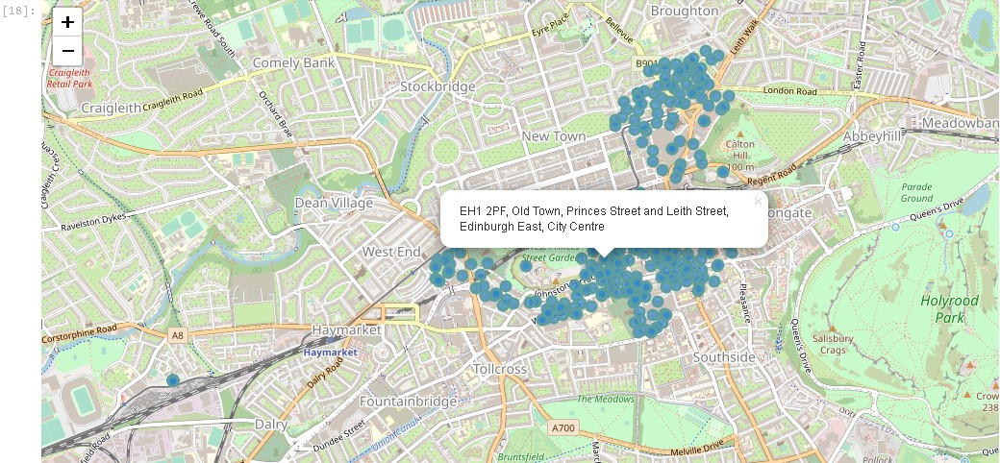
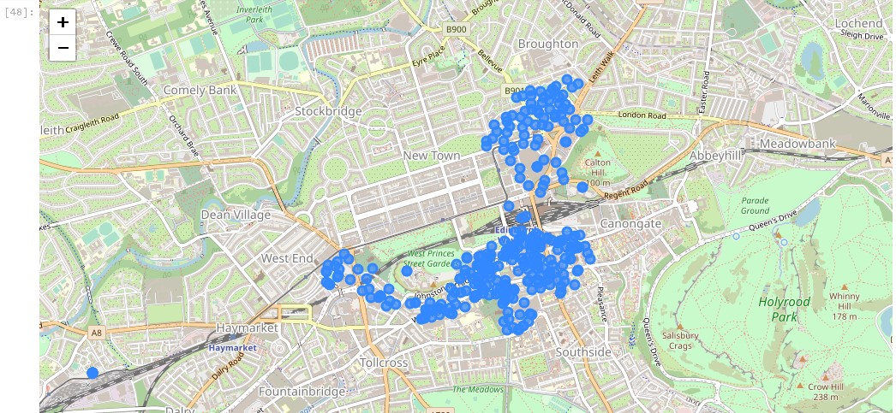

# Researching the Best Place for Urban Farming Spots in Edinburgh

## Introduction

This project researches the best location for urban farming in Edinburgh.

Edinburgh, the capital of Scotland, is a relatively small but vibrant city bustling with international tourists. Even though it is the second most visited city in the UK after London, it only has 537,000 inhabitants, which is relatively a small number compared to other capital cities in the world.

The United Kingdom has been going through [the worst economic contraction](https://www.forbes.com/sites/roberthart/2021/02/12/uk-hit-by-worst-economic-contraction-on-record-amid-covid-19-pandemic/) due to [lockdown restrictions](https://www.cnbc.com/2021/02/22/uk-lockdown-details-and-dates-of-how-it-could-be-lifted.html) caused by the Covid-19 pandemic. [Food prices have gone up](https://www.theguardian.com/business/2021/feb/17/uk-inflation-rises-as-price-of-food-and-furniture-increases) and many people need more affordable food with constant supply. Some communities are initiating urban farming in the city of Edinburgh, which is also experiencing such economic condition. This project aims to find the best location for these urban farming spots.

## The Data

The data used was downloaded from [doogal](https://www.doogal.co.uk/PostcodeDownloads.php), and the specific link to download the Edinburgh post codes csv file is [here](https://www.doogal.co.uk/UKPostcodesCSV.ashx?Search=EH). The data has been previously downloaded and is now accessible at [my repo](https://github.com/eparamasari/Coursera_Capstone/blob/main/data/EH-postcodes.csv).

It has 50 columns, but not all columns are necessary for the research, so initial data cleaning was performed prior to analysis. The columns post code, latitude and longitude coordinates, ward, constituency, rural/urban, and output area will be useful for identification, and the latitude and longitude coordinates will especially be used in the http requests to Foursquare API. The rural/urban will also be used to analyze whether it will be a good place for urban farming, since we would want an area with a lot of community activities.

## Methodology

### Leveraging Foursquare API and clustering

This research uses Foursquare API to analyze the best area in Edinburgh to start an urban farming spot based on surrounding venues. Clustering is also used to divide Edinburgh into different clusters, infer the characteristics of each cluster, then decide on which cluster/area is the best for the location of urban farming spots, based on the venues found in that area.

### Visualizing the Postcode Areas

The following is a map of Edinburgh with all the different areas of postcodes obtained from the data, mapped using folium.

## Results

K-Means Clustering from scikit-learn was used to divide the City of Edinburgh into five clusters. The results show five distinct area in the city as shown in the map below:

## Discussion

The clusters with venues listed in the notebook each has different characteristics as follows.

### Cluster 1: The City Centre

This is the central part of the city, called New Town, with high street shops, a large park, famous churches, historic sites, monuments and landmarks, scenic lookout, outdoor sculpture, a plaza, a theater, and various kinds of restaurants, including Scottish, French, to seafood. Although the various types of nearby venues suggest that this is a good area for urban farming, the postcode markers in the map seem to be very close to one another. We can infer that this area is too overcrowded for additional urban farming spots.

### Cluster 2: The Industrial Bay

This is the northern part of the city with some industrial zones, a large mall and docking ports located in a bay. Although it has quite a significant number of pubs, bars, and restaurants, this would not be a good area for urban farming since the water would be slightly brackish and the surrounding industries mean more air pollution than the other.

### Cluster 3: The Social Hub

This is another central area in the central part of the city comprising the Old Town and its surrounding areas. Adjacent to cluster 1, it is just a little to the south. However, this cluster has slightly different characteristics, with a museum, some hotels, so many cafes, bars and pubs, and various kinds of restaurants serving menus from Mexican to Indian. Famous for its tourist attractions and vibrant nighlife scenes, it is probably not the best place for urban farming.

### Cluster 4: The Picturesque Village

This is the western area covering Dean Village, a traditional village famous among tourists for its picturesque views, and its surrounding neighborhood. Comprising mostly of residential area, this might be a good location for urban farming. Additionally, this cluster also has hotels, grocery stores, pubs, rugby and soccer stadium, and a sports pub, among others. The fact that this area also has a river flowing across it only supports its potential for urban farming spots.

### Cluster 5: The Vibrant Neighborhood

This cluster covers mostly Tollcross area, stretching from the southwest to the eastern part of the city. The cluster has some hotels, historic sites, pubs and bars, and various kinds of restaurants. This might also be a good location for urban farming since it is packed with restaurants which can use the produce for their ingredients. Many residential area in its surroundings also means that the locals can choose to directly purchase the fruits and vegetables. A sizeable park and golf course called Bruntsfield Links was also visible on the map, and the path along the course can make for good locations for urban farming spots.

## Conclusion

After some analysis, it was found that cluster 4, covering Dean Village and nearby area, would be the best location for urban farming spots in Edinburgh. It is surrounded by many restaurants, grocery stores, and traditional residential areas which are all potential buyers for the produce of urban farming.

The second choice would be cluster 5, comprising Tollcross and nearby area, which is more vibrant than cluster 4 but also has many potential buyers such as restaurants, hotels, and also local residents.
